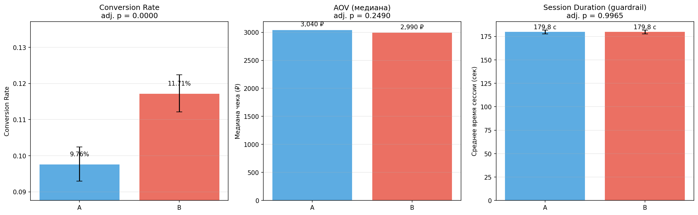

# A/B-тест: кнопка «Купить в 1 клик» на маркетплейсе

Полный цикл анализа продуктового A/B-эксперимента: от дизайна и расчёта
размера выборки до статистических тестов и бизнес-рекомендации о раскатке.

**Стек:** Python, pandas, numpy, scipy, statsmodels, matplotlib, seaborn, Jupyter

---

## Бизнес-контекст

Маркетплейс тестирует замену стандартной корзины на кнопку «Купить в 1 клик».
Гипотеза: упрощение пути покупки повысит конверсию.

- **Группа A (контроль):** стандартная корзина
- **Группа B (тест):** кнопка «Купить в 1 клик»
- **Дизайн:** сплит 50/50, 14 дней, 30 000 пользователей
- **Данные:** синтетические, сгенерированы с известными «истинными» эффектами
  (seed=52, воспроизводимо), включая реалистичные артефакты: пропуски трекинга,
  аномальные заказы («киты»), скошенные распределения чеков

## Дизайн эксперимента

- Power analysis: baseline CR = 10%, MDE = +1 п.п., α = 0.05, power = 0.80
  → требуемая выборка ≈ <ВСТАВЬТЕ ЧИСЛО> пользователей на группу
- Primary-метрика: Conversion Rate
- Secondary: AOV (медиана чека)
- Guardrail: среднее время сессии

## Структура репозитория

```
├── data/
│   └── ab_test_data.csv          # сгенерированный датасет (30k строк)
├── notebooks/
│   ├── 01_data_generation.ipynb  # генерация данных + power analysis
│   ├── 02_eda_and_checks.ipynb   # SRM, пропуски, выбросы, предпосылки тестов
│   └── 03_statistical_tests.ipynb# гипотезы, тесты, поправки, выводы
├── images/
│   └── results_summary.png       # сводная визуализация результатов
├── requirements.txt
└── README.md
```

## Методология

| Этап | Метод | Зачем |
|---|---|---|
| Целостность сплита | Хи-квадрат (SRM-проверка) | убедиться, что эксперимент валиден |
| Пропуски | Анализ механизма (MCAR/MAR) + хи-квадрат | обоснованное решение об удалении строк |
| Выбросы | IQR-правило, boxplot, процентили | найти «китов» и оценить их влияние |
| Предпосылки | Шапиро-Уилк, Д'Агостино, Левен, QQ-plot | выбор между параметрическими и непараметрическими тестами |
| Conversion Rate | Z-тест для долей + Wilson CI | бинарная метрика |
| AOV | Манна-Уитни | скошенное распределение чеков с выбросами |
| Session Duration | t-тест (Стьюдент/Уэлч по Левену) | guardrail с лёгкими хвостами |
| Множественные сравнения | Бенджамини-Хохберг (FDR) | контроль доли ложных открытий |

## 📊 Результаты



| Метрика | Эффект | Adj. p-value | Вывод |
|---|---|---|---|
| Conversion Rate | +1.95 п.п. | 0 | значимый рост |
| AOV (медиана) | -50 ₽ | 0.249 | не значимо |
| Session Duration | +0 c | <0.996 | не значимо |

## Ключевые инсайты

1. Фича значимо повышает конверсию на 1.95% — выше заложенного MDE.
2. Средние чеки различались на ~28% из-за неравномерного попадания
   аномальных заказов в группу B; медианы и ранговый тест показали,
   что реального эффекта на чек нет — классическая ловушка mean-метрик.
3. Guardrail не деградировал: время сессии не изменилось.

## Бизнес-рекомендация

Раскатать фичу на 100% трафика на основании значимого роста primary-метрики
при нейтральных secondary и чистом guardrail. Мониторинг после раскатки.

## Воспроизведение

```bash
git clone https://github.com/Necrobos/a-b_test_project.git
cd a-b_test_project
python -m venv venv && source venv/Scripts/activate   # Windows Git Bash
pip install -r requirements.txt
jupyter notebook
```

Все ноутбуки самодостаточны: открывайте по порядку 01 → 02 → 03
(или Kernel → Restart & Run All в каждом).
